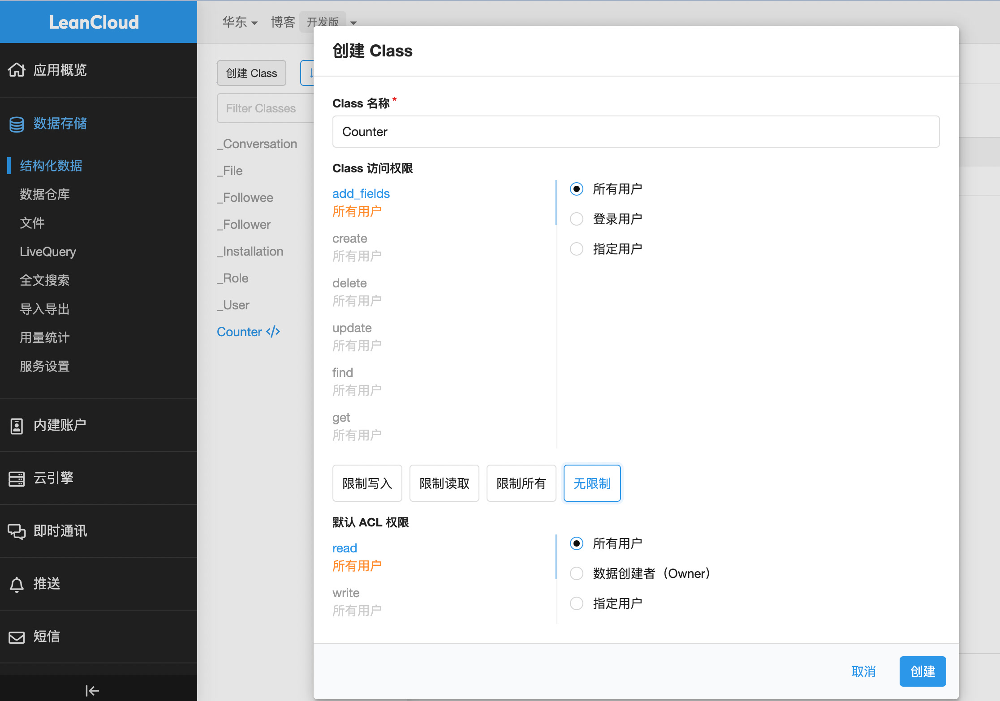
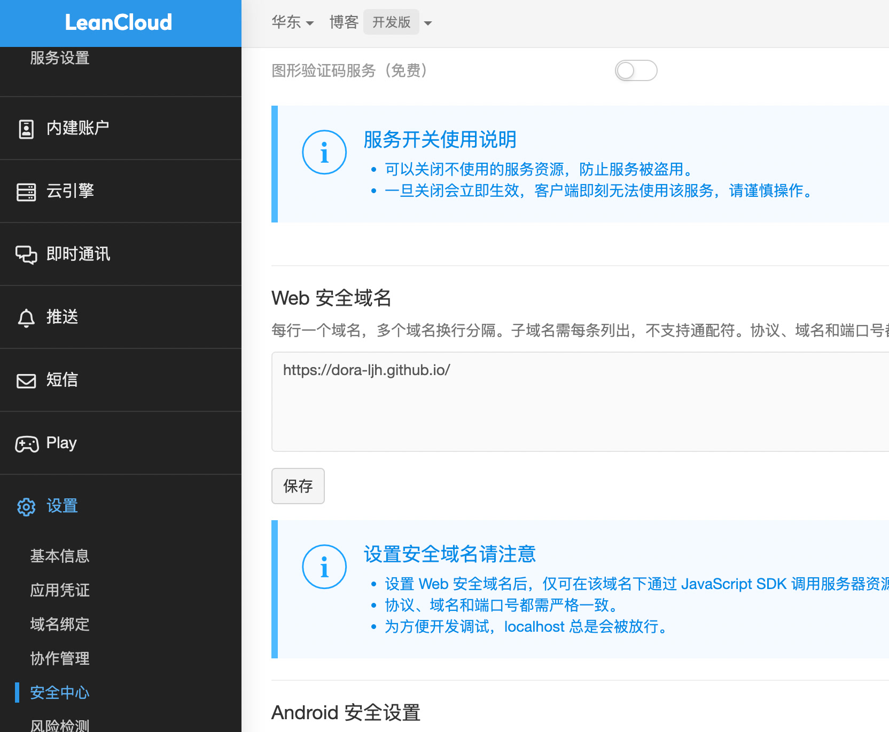
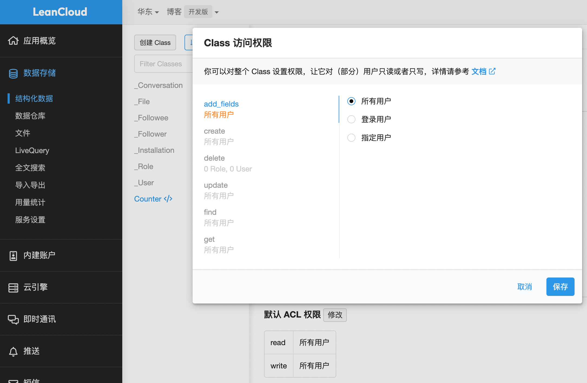

在本文中，我们将介绍如何在使用 Hexo 和 next 主题的博客中配置 LeanCloud 阅读数。本文将详细说明每个步骤，以便您轻松地在您的博客中实现阅读计数器功能。

<!-- more -->

## 在 LeanCloud 中创建应用

首先，在 LeanCloud 中创建应用。创建国内应用时，需要填写个人信息。如果您在国内搭建博客，请选择国内节点（华北或华东）。国际版可能会在手机端出现 "LeanCloud cannot load XXX due to access control checks. 403" 错误。创建好应用后，进入设置，创建 Class，命名为 "Counter"，选择无限制，然后点击创建。这一步是为了让阅读数保存到数据库。


## 添加 Web 安全域名

在设置 > 安全中心 \> Web 安全域名中，将您的博客域名添加到列表中，例如：`https://dora-ljh.github.io/`。这一步是为了防止其他域名拿到应用 ID 和应用 KEY 也能调用 API。


## 安装 hexo-leancloud-counter-security

在项目根目录下运行以下命令，安装 `hexo-leancloud-counter-security` 插件：

```bash
npm install hexo-leancloud-counter-security --save
```

## 配置根目录的 _config.yml
在根目录的 `_config.yml` 文件中，添加以下配置：

```yaml
leancloud_counter_security:
  enable_sync: true
  app_id: <your app id>
  app_key: <your app key>
  language: zh-CN
  server_url: <your app server_url>
```

*   `<your app id>` 是 LeanCloud 设置 > 应用凭证中的 AppID。

*   `<your app key>` 是 LeanCloud 设置 > 应用凭证中的 AppKey。

*   `<your app server_url>` 是 LeanCloud 设置 > 应用凭证中的 REST API 服务器地址。

## 配置 next 主题的 config.yml

在 next 主题的 `config.yml` 文件中，添加以下配置：

```yaml
leancloud_visitors:
  enable: true
  app_id: <your app id>
  app_key: <your app key>
  security: false # 这里配置为 false
  betterPerformance: false
```

将 `security` 配置为 `false`，以避免出现 "Counter not initialized! More info at console err msg." 错误，导致无法显示阅读数。

## 提交部署

最后，提交并部署您的博客。现在，您应该能在博客中看到阅读计数器。

## 提高安全性（可选）

如果您希望提高阅读计数器的安全性，可以执行以下操作：

1.  使用以下命令创建一个新的 LeanCloud 用户：

    ```bash
    hexo lc-counter register <username> <password>
    ```

    如果您没有在 `leancloud_counter_security` 中设置 `server_url`，在国内节点的应用可能会出现 "serverURL option is required for apps from CN region" 错误。

2.  在 `leancloud_counter_security` 中配置用户名和密码：

    ```yaml
    username: <your username> # 部署时将要求填写用户名
    password: <your password> # 建议留空。部署时将要求填写密码
    ```

    在 LeanCloud 的数据存储 > 结构化数据中的 `_User` 表中创建一个新用户。

3.  修改 `Counter` 类的访问权限：

    在 LeanCloud 的数据存储 > 结构化数据 > `Counter` 类中，点击 "权限" > "Class 访问权限"。将 "add_fields" 和 "create" 权限修改为指定用户，然后选择刚才创建的用户。

4.  禁止删除权限：

    修改 "delete" 权限为指定用户，但不选择任何用户，然后点击保存。



第2步，和第3步，我并没有设置成功，我用的是github的 Actions 并没有询问我账号密码，设置之后会出现无法添加字段等问题。接口403，故只配置了第4步。


完成以上步骤后，您的阅读计数器将更安全地运行在博客中。
